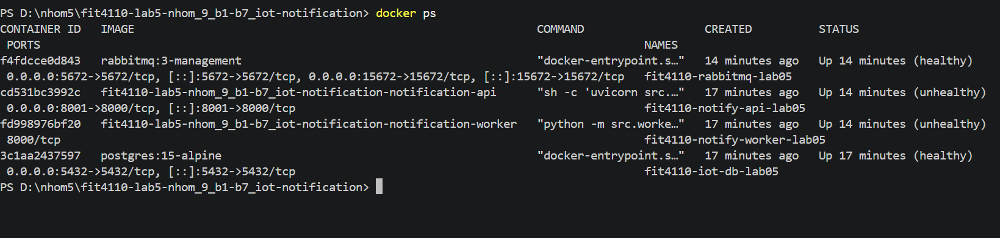
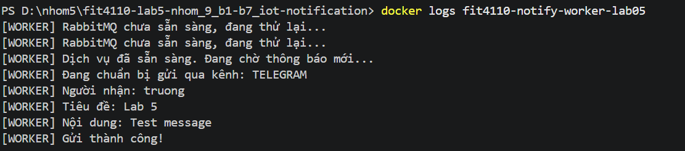

# Báo cáo Lab 05: Xây dựng hệ thống IoT với Message Queue

## 1. Mục tiêu
Xây dựng hệ thống thông báo bất đồng bộ cho quy trình quản lý kiện hàng Kén, sử dụng kiến trúc Microservices và Message Queue để tách biệt giữa xử lý API và thực thi tác vụ nền (Worker).

## 2. Kiến trúc hệ thống
Hệ thống bao gồm các thành phần chính:
* **IoT API:** Tiếp nhận dữ liệu cảm biến và yêu cầu gửi thông báo.
* **RabbitMQ:** Trung tâm điều phối tin nhắn (Message Broker) giúp hệ thống chịu tải cao và không bị nghẽn.
* **Notification Worker:** Lắng nghe hàng đợi và thực hiện gửi thông báo (Telegram/Email).
* **Database (PostgreSQL):** Lưu trữ dữ liệu hệ thống.

## 3. Quy trình thực hiện & Xử lý lỗi
Trong quá trình triển khai, nhóm đã vượt qua các thách thức kỹ thuật sau:
* **Xử lý tài nguyên:** Tối ưu hóa Docker Volume và dọn dẹp bộ nhớ đệm để khắc phục lỗi không gian lưu trữ.
* **Tương thích hệ điều hành:** Chuyển đổi RabbitMQ image từ bản `alpine` sang `3-management` để khắc phục lỗi xung đột kiến trúc CPU trên môi trường Windows.
* **Cấu hình mạng:** Tự động hóa việc khởi tạo `class-net` để các container có thể giao tiếp với nhau.

## 4. Minh chứng kết quả
### 4.1 Trạng thái các Container
Kết quả lệnh `docker ps` cho thấy toàn bộ hệ thống đã chạy ổn định:

### 4.2 Luồng xử lý thông báo
Minh chứng hệ thống nhận dữ liệu qua API và Worker xử lý gửi thành công qua Telegram:

## 5. Kết luận
Hệ thống đã vận hành đúng theo yêu cầu thiết kế. Việc sử dụng RabbitMQ giúp API luôn phản hồi nhanh (asynchronous), đồng thời đảm bảo không bỏ sót các yêu cầu thông báo ngay cả khi Worker đang bận xử lý.

---
*Người thực hiện: Nguyễn Hà Phương & Nhóm 9*